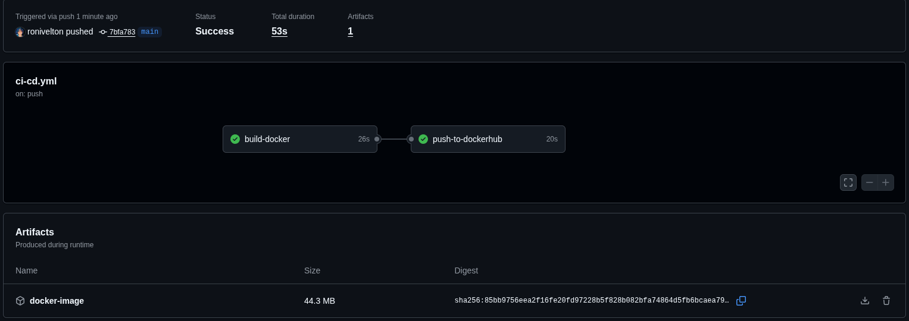
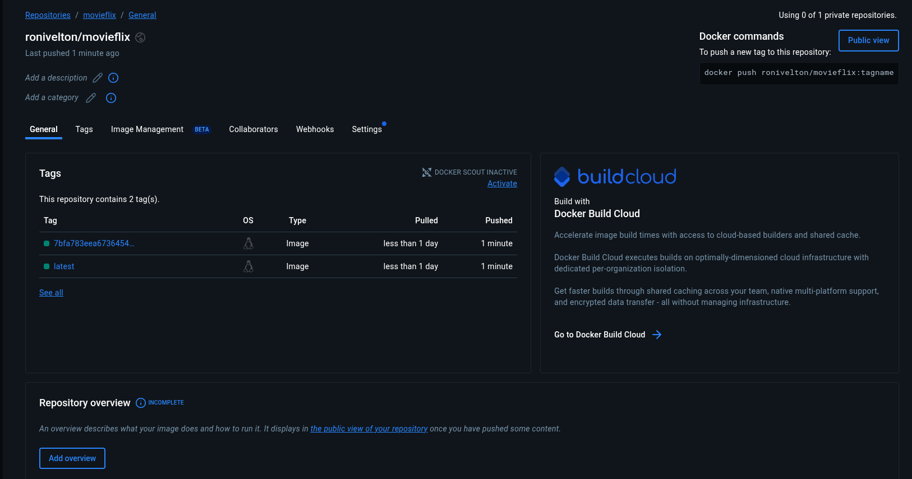
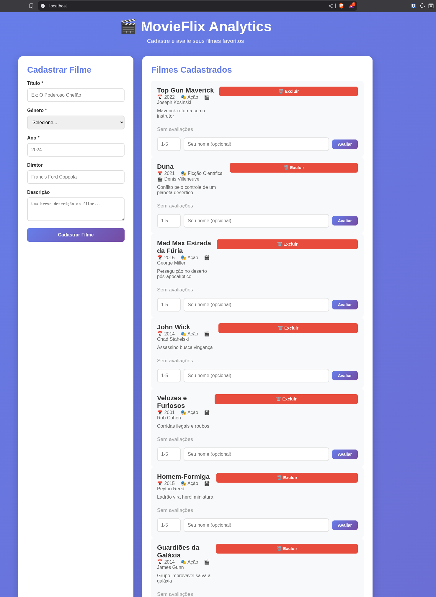
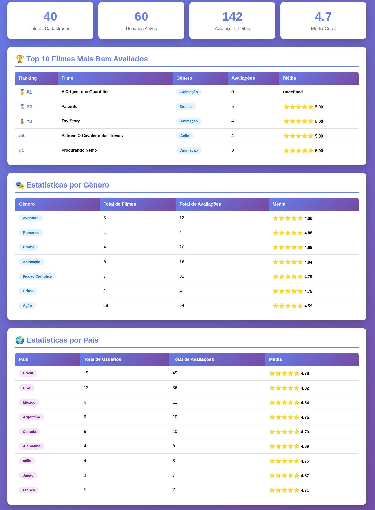

# MovieFlix Analytics

Plataforma de cadastro e avaliação de filmes com análise de dados, desenvolvida para o Projeto final da Ada.

---

## Como Executar

### Com Docker (Recomendado)

```bash
# 1. Clone o repositório
git clone https://github.com/ronivelton/movieflix-analitycs.git
cd movieflix

# 2. Inicie os containers
docker-compose up --build -d

# 3. Aguarde inicialização (~30 segundos)

# 4. Carregue os dados no banco
docker exec -it movieflix-app node scripts/etl-load-data.js
```

**Acesse:**
- Interface: http://localhost
- Analytics: http://localhost/analytics

---

## Arquitetura

```
┌─────────────┐
│   Cliente   │
└──────┬──────┘
       │ HTTP (porta 80)
       ↓
┌──────────────────┐
│ Nginx (Proxy)    │
└──────┬───────────┘
       │ porta 3000
       ↓
┌──────────────────┐
│ App Node.js      │
└──────┬───────────┘
       │ porta 5432
       ↓
┌──────────────────┐
│ PostgreSQL       │
└──────────────────┘
```

**Fluxo de Dados:**
```
Data Lake (CSV) → ETL → Data Warehouse (PostgreSQL) → Data Mart (Views) → API → Frontend
```

---

## Estrutura de Dados

### Data Lake
- `movies.csv` - 40 filmes
- `users.csv` - 61 usuários (11 países)
- `ratings.csv` - 150 avaliações

### Data Warehouse (PostgreSQL)
- `movies` - Filmes cadastrados
- `users` - Usuários da plataforma
- `ratings` - Avaliações

### Data Mart (Views)
- `vw_top_movies` - Top filmes mais bem avaliados
- `vw_stats_genero` - Estatísticas por gênero
- `vw_stats_pais` - Estatísticas por país

---

## CI/CD

Pipeline configurado no GitHub Actions:

1. **Build**: Constrói imagem Docker
2. **Push**: Publica no Docker Hub (apenas branch main)

### Configurar CI/CD

1. Crie conta no [Docker Hub](https://hub.docker.com)
2. Gere um Token em **Account Settings → Personal Token**
3. No GitHub, vá em **Settings → Secrets → Actions**
4. Adicione os secrets:
   - `DOCKER_USERNAME`: usuário do Docker Hub
   - `DOCKER_PASSWORD`: token gerado
5. Faça push para `main` e o pipeline executará automaticamente

---

## API

### Filmes
- `GET /api/movies` - Lista filmes
- `POST /api/movies` - Cadastra filme
- `POST /api/movies/:id/rate` - Avalia filme
- `DELETE /api/movies/:id` - Remove filme

### Analytics
- `GET /api/analytics/dashboard` - Dashboard completo
- `GET /api/analytics/genero` - Stats por gênero
- `GET /api/analytics/pais` - Stats por país

---

## Tecnologias

- **Backend**: Node.js + Express.js
- **Banco de Dados**: PostgreSQL 15
- **Frontend**: HTML5, CSS3, JavaScript
- **Proxy**: Nginx
- **Containers**: Docker + Docker Compose
- **CI/CD**: GitHub Actions
- **Registry**: Docker Hub

---

## Testes

### Interface Web
- Filmes: http://localhost
- Analytics: http://localhost/analytics

### API
```bash
curl http://localhost/health
curl http://localhost/api/movies
curl http://localhost/api/analytics/dashboard
```

### PostgreSQL
```bash
docker exec -it movieflix-postgres psql -U movieflix -d movieflix_db

# Consultas
SELECT * FROM vw_top_movies LIMIT 10;
SELECT * FROM vw_stats_genero;
SELECT * FROM vw_stats_pais;

# Sair: \q
```

### ETL
```bash
docker exec -it movieflix-app node scripts/etl-load-data.js
```

---

## Demonstração Prática

### 1. Pipeline GitHub Actions



---

### 2. Imagem no Docker Hub



---

### 3. Aplicação Acessível via Nginx



---

### 4. Dashboard Analytics (Data Mart)



---

## Observações

Foi feito o uso de IAs para auxilio no desenolvimento mais rapidamente do frontend e APIs. O restante foi utilizado as mesmas apenas para tirar dúvidas e relembrar.
